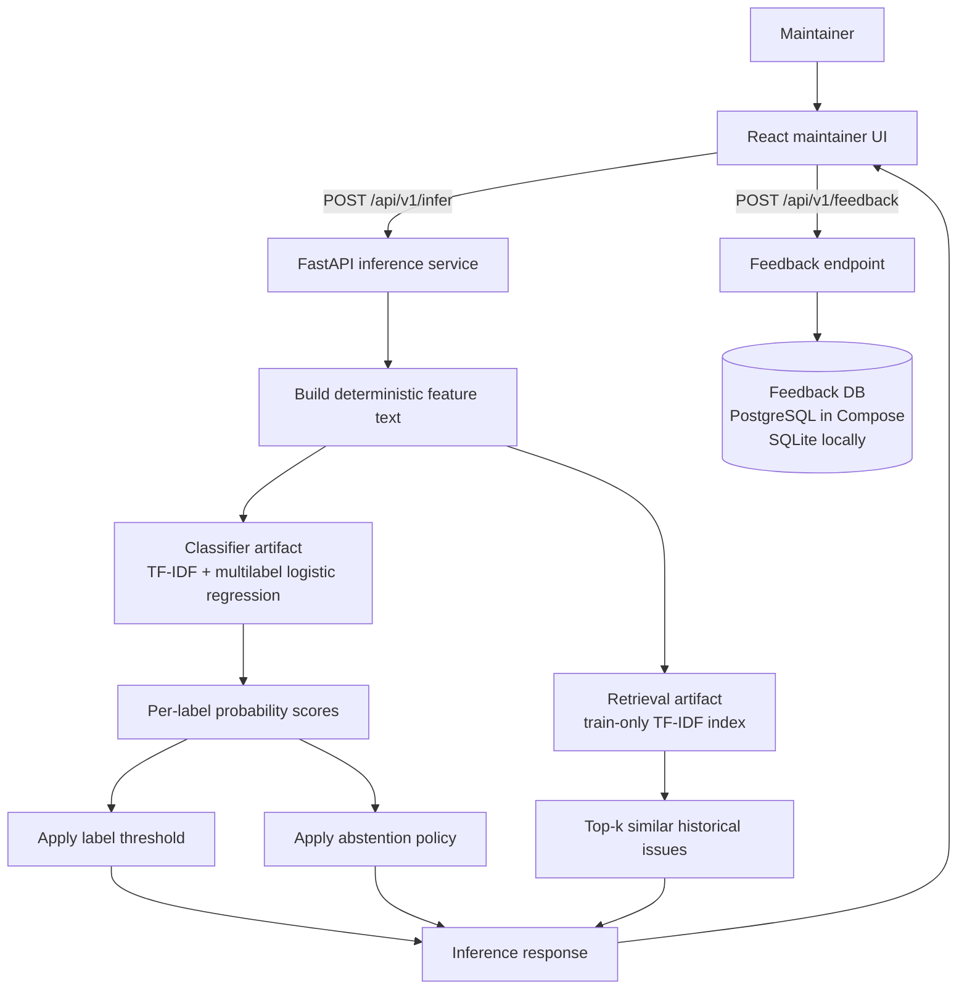
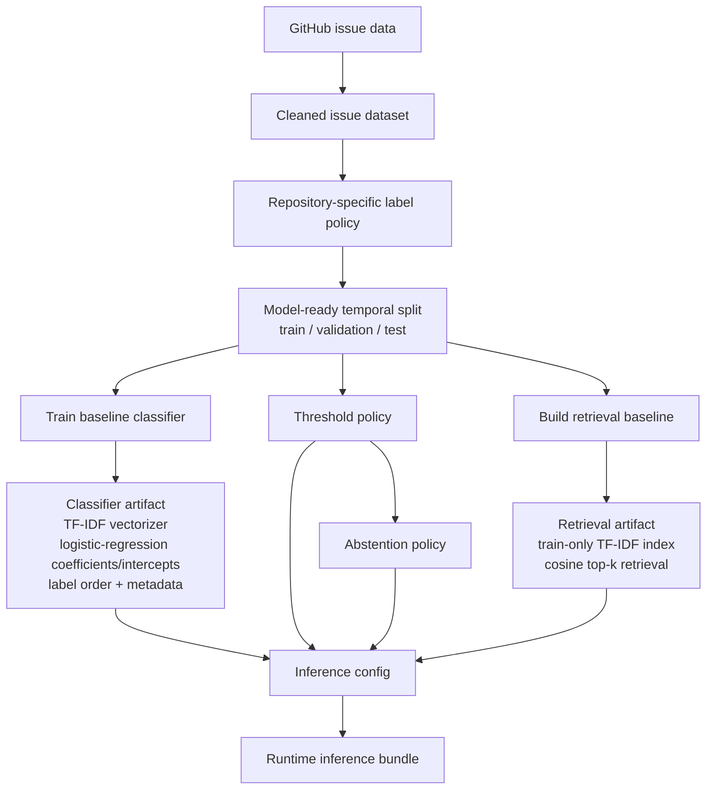

# RepoTriage

Local issue intelligence for open-source maintainers.

RepoTriage predicts labels for GitHub issues, recommends abstention when confidence is too low, retrieves similar historical issues, and records maintainer feedback — a local review loop, not a standalone classifier.


## What is RepoTriage?

Open-source maintainers need to label, route, and review incoming issues. RepoTriage is a maintainer-facing GitHub issue intelligence system that scores an issue, predicts likely labels, recommends abstention when confidence is too low, surfaces similar historical issues, and captures human review.

The system combines prediction, confidence-aware abstention, retrieval context, and feedback persistence into one maintainer review workflow.

## Core workflow

```text
Issue title/body
  → label prediction
  → confidence + abstention
  → similar issue retrieval
  → maintainer review
  → feedback persistence
```

## Demo

The primary local demo path uses Docker Compose for `pandas-dev/pandas`.

### Prerequisites

- Python 3.11+
- Node.js 20+
- Docker + Docker Compose
- Generated RepoTriage artifacts under `data/` (not committed to git)

```bash
python -m pip install -e ".[dev,ml,db]"

repotriage check-artifacts --strict --config configs/inference/pandas-dev__pandas/local-v1.json
cp .env.example .env
docker compose up --build
```

Open [http://localhost:5173](http://localhost:5173).

Try the flow: click **Bug · indexing**, score the issue, then review prediction, abstention, similar issues, and feedback.

- Backend API: `http://localhost:8000`
- Maintainer UI: `http://localhost:5173`

If artifacts are missing or invalid, see [`docs/demo.md`](docs/demo.md).


## Key features

- Repository-specific multilabel classification
- Confidence-aware abstention when prediction confidence is too low
- Similar historical issue retrieval for review context
- Maintainer feedback capture (accept / correct / reject)
- FastAPI inference backend
- PostgreSQL-backed feedback persistence in Docker Compose (SQLite default for non-Compose local serve)
- React maintainer review UI
- Artifact readiness checks (`repotriage check-artifacts`)

## Architecture

RepoTriage is split into two paths:

1. an **offline artifact-building path** that prepares datasets, models, thresholds, abstention policy, and retrieval indexes;
2. a **runtime review path** that serves predictions, retrieval results, and feedback capture through the API and UI.

### Runtime system architecture



### Offline ML artifact pipeline



### Runtime responsibilities

- **React UI** — provides the maintainer workbench, displays predictions, abstention, similar issues, and feedback controls.
- **FastAPI inference service** — loads the configured artifacts and serves `/infer`, `/feedback`, and `/health`.
- **Classifier artifact** — contains the TF-IDF vectorizer, learned logistic-regression parameters, label order, and model metadata.
- **Threshold policy** — decides which label probabilities become predicted labels.
- **Abstention policy** — decides whether the model should recommend human review.
- **Retrieval artifact** — retrieves similar historical issues from a train-only TF-IDF index.
- **Feedback DB** — stores accept, reject, and correction events for future analysis or retraining.

## How the ML engine works

RepoTriage uses a reproducible baseline ML stack, not a black-box LLM call.

- Issue title/body text is converted into a deterministic feature-text representation.
- TF-IDF converts that text into sparse numeric features.
- A multilabel logistic regression classifier predicts per-label probability scores.
- Learned parameters — TF-IDF vocabulary/IDF values and logistic-regression coefficients — are stored in local artifacts.
- A label threshold decides which labels are returned.
- An abstention policy recommends human review when confidence is below the configured cutoff.
- Similar issue retrieval uses a train-only TF-IDF index and cosine similarity.

This baseline-first design keeps the system reproducible, fast locally, and easier to inspect than a large opaque model.

### Modeling considerations

- Temporal train/validation/test split to reduce leakage
- Repository-specific labels rather than generic universal labels
- Train-only indexing for similar-issue retrieval
- Abstention as a product feature, not just a metric
- Feedback persistence for future retraining/evaluation — not online learning yet

## Evaluation

RepoTriage is evaluated as a baseline ML system, not assumed correct from the UI alone.

The current `pandas-dev/pandas` demo uses temporal train/validation/test splits so later issues are evaluated against artifacts trained on earlier issues. The classifier is treated as a multilabel problem and evaluated with precision, recall, and F1-style metrics rather than a single accuracy number.

Similar-issue retrieval is evaluated separately using label-overlap retrieval metrics. The retrieval index is built only from the training split to avoid leaking validation/test issues into historical search results. The TF-IDF cosine retrieval baseline achieved validation recall@10 of 0.913 and test recall@10 of 0.942.

Runtime checks verify that the expected model, threshold, abstention, and retrieval artifacts are present and loadable before the demo starts.

## Tech stack

Python, scikit-learn, FastAPI, SQLAlchemy, PostgreSQL, SQLite, React, Vite, TypeScript, Docker Compose, pytest, Vitest, Ruff.

## API

| Method | Path | Purpose |
|--------|------|---------|
| `GET` | `/health` | Liveness + loaded repository / config |
| `POST` | `/api/v1/infer` | Score an issue title/body |
| `POST` | `/api/v1/feedback` | Store maintainer review feedback |

## Current demo target

- Repository: **pandas-dev/pandas**
- **15** canonical target labels from the repo-specific label policy (for example Bug, Docs, Indexing, Missing-data, Performance, and Regression)
- One-repo MVP for local demos
- Architecture is config- and artifact-oriented, but **multi-repo support is not currently shipped**

## Artifact readiness

Generated ML artifacts are not committed. Fresh clones must copy or build them before inference/Compose starts. Datasets and model artifacts are intentionally kept out of git; configs, validators, and readiness checks are tracked.

```bash
repotriage check-artifacts --strict \
  --config configs/inference/pandas-dev__pandas/local-v1.json
```

Detailed copy-vs-generate setup: [`docs/demo.md`](docs/demo.md).

## Human review and feedback

After scoring, maintainers can accept, correct, or reject predicted labels. Reviews are stored with issue metadata and inference artifact IDs.


## Run or adapt locally

Clone the repository to run the current `pandas-dev/pandas` demo locally.

Fork it if you want to adapt RepoTriage for another repository, change the label policy, swap the baseline classifier, or experiment with a different ML backend.

Adapting RepoTriage to another repository is supported by the artifact/config layout, but it is not a one-click feature. You need to rebuild the dataset, label policy, model artifacts, thresholds, abstention policy, and retrieval index for the new repository.

## Testing

```bash
python -m pytest -q
ruff check .
cd frontend && npm test -- --run
cd frontend && npm run build
./scripts/check-demo-ready.sh
./scripts/docker-smoke.sh
```

## Design decisions and tradeoffs

- Classical TF-IDF + logistic regression baseline instead of transformer fine-tuning — reproducible and fast for local inference
- Repository-specific labels instead of generic universal labels
- Abstention to avoid overconfident automation when confidence is low
- Similar issue retrieval as review context, not guaranteed duplicate detection
- Feedback is persisted but not yet used for retraining
- Artifacts are generated and versioned locally rather than committed
- The UI is intentionally minimal and focused on the maintainer review loop rather than dashboards, authentication, or analytics before the core workflow is useful

## Limitations

- Current demo targets **pandas-dev/pandas** only
- No hosted public deployment yet
- Artifacts must be generated or copied locally
- Model is a baseline classical ML system
- Feedback is stored but not used for online learning / retraining yet
- No GitHub OAuth
- No automatic GitHub write-back
- Similar issues are nearest-neighbor context, not definitive duplicates

## Documentation

- [`docs/demo.md`](docs/demo.md) — local demo, artifact copy/generate, Compose smoke testing
- [`docs/development-notes.md`](docs/development-notes.md) — concise pipeline / subsystem overview
